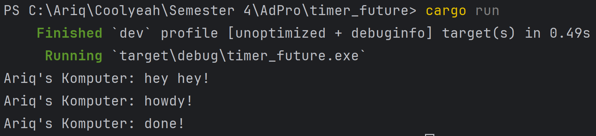
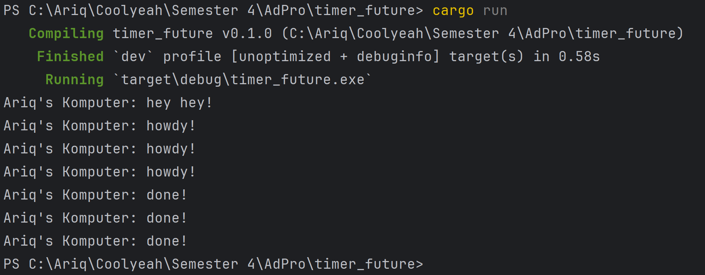
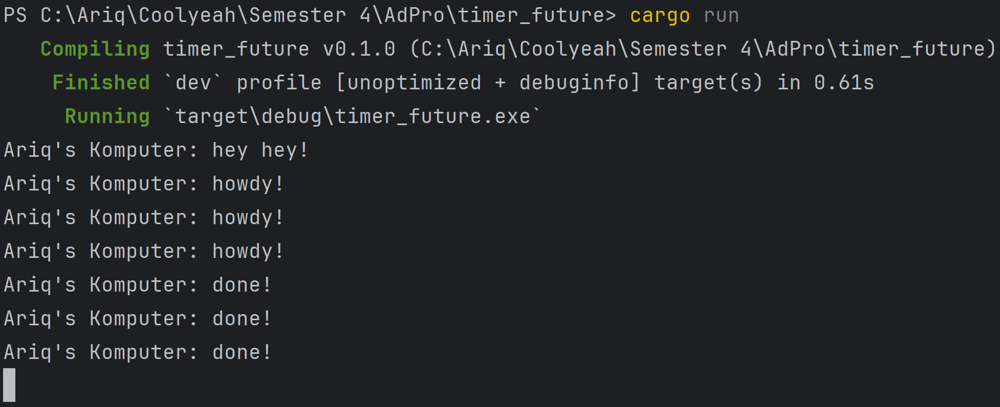

## Reflection
### Experiment 1.2:
dengan menambahkan `println!("Ariq's Komputer: hey hey!");` setelah `spawner.spawn`, run program akan mengeluarkan:

`println!("Ariq's Komputer: hey hey!");` diletakkan setelah task di spawn yang berisi print howdy dan done dan sebelum `executor.run();`. Ini menyebabkan async task dimasukkkan ke queue, tapi belum dijalankan langsung. `executor.run();` akan menjalankan async task yang ada di queue tersebut. Jadi `println!("Ariq's Komputer: hey hey!");` akan berjalan secara synchronous di `main` lalu task lain akan dijalankan secara asynchronous.

### Experiment 1.3:
Run multiple spawn dengan `drop(spawner);`:

Program ini menjalankan beberapa task async secara bersamaan dengan memanggil `spawner.spawn(...)` tiga kali. Masing-masing task mencetak "howdy!", menunggu 2 detik dengan TimerFuture, lalu mencetak "done!". Karena ketiganya dimulai hampir bersamaan, ketiga "howdy!" muncul langsung, lalu setelah 2 detik, ketiga "done!" muncul hampir bersamaan. Ini menunjukkan bagaimana eksekusi asynchronous memungkinkan banyak task berjalan bergantian dalam satu thread tanpa saling menghalangi. Lalu program exit dengan adanya `drop(spawner);` menandakan bahwa tidak akan ada lagi task baru yang dikirim ke executor. Dengan begitu, setelah semua task dalam antrean selesai dijalankan, executor akan berhenti secara otomatis karena channel ready_queue akan tertutup. 

Run multiple spawn tanpa `drop(spawner);`:

Ketika `drop(spawner);` tidak digunakan, channel tetap terbuka dan executor akan terus menunggu task baru selamanya. Akibatnya, meskipun semua task yang sudah dikirim selesai dijalankan, program tidak akan pernah berhenti karena executor masih menganggap kemungkinan adanya task baru.

