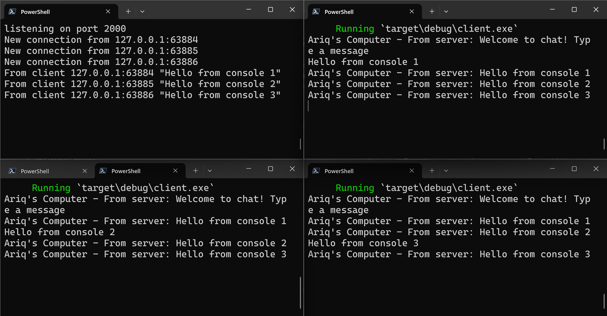
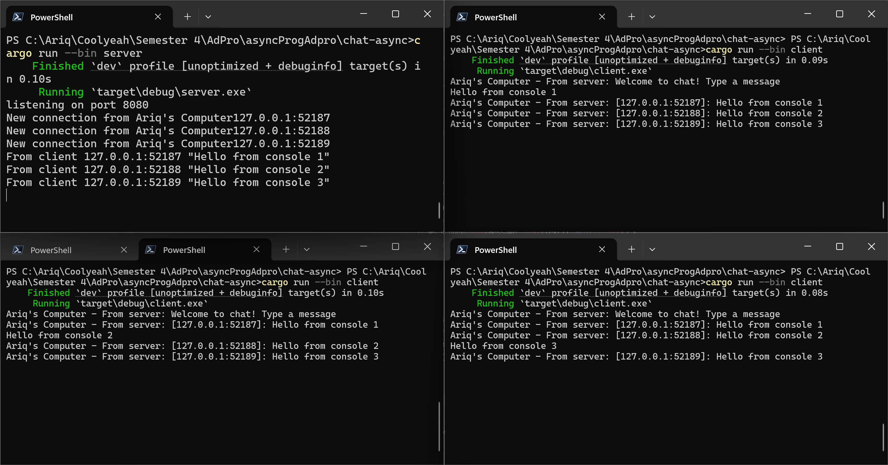
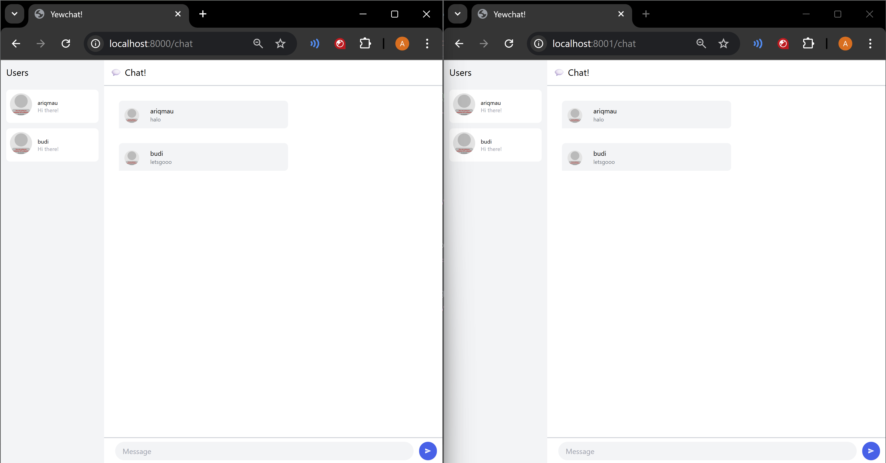

## Reflection
### Experiment 1.2:
dengan menambahkan `println!("Ariq's Komputer: hey hey!");` setelah `spawner.spawn`, run program akan mengeluarkan:

`println!("Ariq's Komputer: hey hey!");` diletakkan setelah task di spawn yang berisi print howdy dan done dan sebelum `executor.run();`. Ini menyebabkan async task dimasukkkan ke queue, tapi belum dijalankan langsung. `executor.run();` akan menjalankan async task yang ada di queue tersebut. Jadi `println!("Ariq's Komputer: hey hey!");` akan berjalan secara synchronous di `main` lalu task lain akan dijalankan secara asynchronous.

### Experiment 1.3:
Run multiple spawn dengan `drop(spawner);`:

Program ini menjalankan beberapa task async secara bersamaan dengan memanggil `spawner.spawn(...)` tiga kali. Masing-masing task mencetak "howdy!", menunggu 2 detik dengan TimerFuture, lalu mencetak "done!". Karena ketiganya dimulai hampir bersamaan, ketiga "howdy!" muncul langsung, lalu setelah 2 detik, ketiga "done!" muncul hampir bersamaan. Ini menunjukkan bagaimana eksekusi asynchronous memungkinkan banyak task berjalan bergantian dalam satu thread tanpa saling menghalangi. Lalu program exit dengan adanya `drop(spawner);` menandakan bahwa tidak akan ada lagi task baru yang dikirim ke executor. Dengan begitu, setelah semua task dalam antrean selesai dijalankan, executor akan berhenti secara otomatis karena channel ready_queue akan tertutup. 

Run multiple spawn tanpa `drop(spawner);`:

Ketika `drop(spawner);` tidak digunakan, channel tetap terbuka dan executor akan terus menunggu task baru selamanya. Akibatnya, meskipun semua task yang sudah dikirim selesai dijalankan, program tidak akan pernah berhenti karena executor masih menganggap kemungkinan adanya task baru.

### Experiment 2.1: Original code, and how it run
Run one server(top left), and three clients:

Server WebSocket dijalankan pada port 2000 menggunakan tokio, dan tiga client terhubung ke server tersebut. Setiap client dapat mengirimkan pesan melalui terminal, dan pesan tersebut akan dikirim ke server. Lalu server menyiarkan/broadcast pesan itu ke semua client lain, termasuk pengirimnya. Jadi, setiap kali salah satu client mengetik dan mengirimkan pesan, pesan tersebut langsung muncul di semua client lainnya secara real-time seperti yang bisa dilihat discreenshot.

### Experiment 2.2: Modifying port
Pada server, port diubah pada baris `TcpListener::bind("127.0.0.1:2000")` menjadi `TcpListener::bind("127.0.0.1:8080")`, sedangkan pada client, URI WebSocket diubah dari `ws://127.0.0.1:2000` menjadi `ws://127.0.0.1:8080`. WebSocket merupakan koneksi dua arah antara client dan server, sehingga port yang digunakan untuk membuka koneksi harus sama di kedua sisi.

### Experiment 2.3: Small changes, add IP and Port
Run after changes:

Perubahan dilakukan di server dengan mengubah:
```
if let Some(text) = msg.as_text() {
    println!("From client {addr:?} {text:?}");
    let msg = format!("[{addr}]: {text}");
    bcast_tx.send(msg)?;
}
```
Penambahan informasi alamat IP dan port dilakukan di sisi server karena hanya server yang memiliki akses langsung terhadap informasi tersebut ketika sebuah koneksi WebSocket diterima dan server bertugas menyebarkan pesan ke semua client.

### Experiment 3.1: Original code
