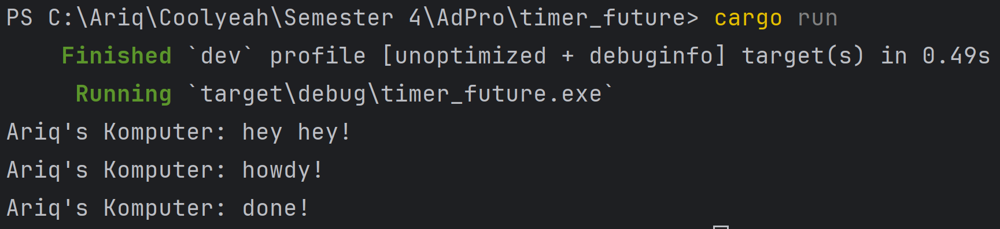

## Reflection
### Experiment 1.2:
dengan menambahkan `println!("Ariq's Komputer: hey hey!");` setelah `spawner.spawn`, run program akan mengeluarkan:

`println!("Ariq's Komputer: hey hey!");` diletakkan setelah task di spawn yang berisi print howdy dan done dan sebelum `executor.run();`. Ini menyebabkan async task dimasukkkan ke queue, tapi belum dijalankan langsung. `executor.run();` akan menjalankan async task yang ada di queue tersebut. Jadi `println!("Ariq's Komputer: hey hey!");` akan berjalan secara synchronous di `main` lalu task lain akan dijalankan secara asynchronous.

